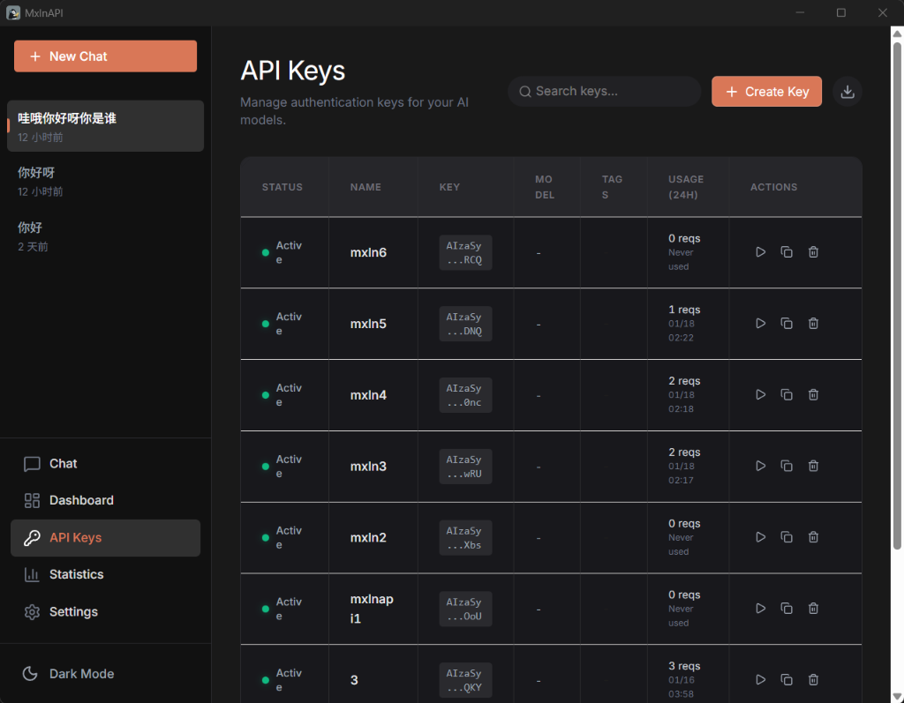

# 任务：API Keys 页面优化

## 角色
Frontend (ui-ux-pro-max)

## Skills 依赖
- `.agent/skills/ui-ux-pro-max/SKILL.md`

---

## 背景

MuxueTools 前端的 API Keys 管理页面已基本可用，但存在 UI/UX 问题需要优化：

**当前问题（见下图）：**



1. **MODEL 列显示不完整**：列宽不足导致内容被截断，且该列信息价值不高
2. **右侧滚动条影响美观**：页面右侧有明显的滚动条，破坏整体视觉效果
3. **字号和间距不统一**：整体字号偏小，需要调整以提升可读性
4. **搜索功能未实现**：搜索栏存在但无实际过滤功能
5. **导入功能未实现**：导出按钮存在但导入功能缺失

**已完成的前置工作：**
- Key 管理 CRUD 基础功能 ✅
- 4 步验证向导 ✅
- 基础 UI 骨架 ✅

---

## 目标

| # | 目标 | 优先级 |
|---|------|--------|
| 1 | 删除 MODEL 列 | P0 |
| 2 | 隐藏/美化右侧滚动条 | P0 |
| 3 | 调整字号和间距 | P1 |
| 4 | 实现搜索功能 | P1 |
| 5 | 实现导入功能 | P1 |
| 6 | UI 细节打磨 | P2 |

---

## 步骤

### 阶段 0：阅读规范 (必须)

1. **Skills 规范**
   - `.agent/skills/ui-ux-pro-max/SKILL.md` - UI/UX 设计规范

2. **项目文档**
   - `docs/FRONTEND_WORKFLOW.md` - 前端开发流程
   - `docs/FRONTEND_PROJECT.md` - 前端项目状态

3. **相关代码**
   - `web/src/views/KeyManagerView.vue` - 当前实现
   - `web/src/stores/keyStore.ts` - Key 状态管理
   - `web/src/api/keys.ts` - Key API 接口

---

### 步骤 1: 删除 MODEL 列

**修改文件**: `web/src/views/KeyManagerView.vue`

在 `columns` 数组中删除 MODEL 列定义（约第 133-139 行）：

```typescript
// 删除以下列定义
{
  title: 'MODEL',
  key: 'default_model',
  render(row: KeyInfo) {
    return h('span', { class: 'text-xs text-claude-secondaryText dark:text-gray-400' }, row.default_model || '-')
  }
},
```

---

### 步骤 2: 隐藏右侧滚动条

**修改文件**: `web/src/views/KeyManagerView.vue` 或全局样式

添加 CSS 隐藏滚动条（保持滚动功能）：

```css
/* 隐藏滚动条但保持滚动功能 */
.scrollbar-hide {
  -ms-overflow-style: none;  /* IE and Edge */
  scrollbar-width: none;  /* Firefox */
}

.scrollbar-hide::-webkit-scrollbar {
  display: none;  /* Chrome, Safari, Opera */
}
```

在模板根元素或 `n-data-table` 容器应用此类。

---

### 步骤 3: 调整字号和间距

**修改文件**: `web/src/views/KeyManagerView.vue`

调整以下样式：

| 元素 | 当前 | 建议 |
|------|------|------|
| 表头字号 | 11px | 12px |
| 表格单元格 padding | 16px 24px | 12px 16px 或 16px 20px |
| 状态文字 | text-xs | text-sm |
| Key 显示 | text-xs | text-sm |

更新 `<style scoped>` 中的 `:deep()` 规则。

---

### 步骤 4: 实现搜索功能

**修改文件**: `web/src/views/KeyManagerView.vue`

1. 添加 `computed` 过滤逻辑：

```typescript
const filteredKeys = computed(() => {
  if (!searchText.value) return store.keys
  const search = searchText.value.toLowerCase()
  return store.keys.filter(key => 
    key.name?.toLowerCase().includes(search) ||
    key.key?.toLowerCase().includes(search) ||
    key.tags?.some(tag => tag.toLowerCase().includes(search))
  )
})
```

2. 将 `n-data-table` 的 `:data` 绑定从 `store.keys` 改为 `filteredKeys`：

```vue
<n-data-table
  :data="filteredKeys"
  ...
/>
```

---

### 步骤 5: 实现导入功能

**涉及文件**: 
- `web/src/views/KeyManagerView.vue`
- `web/src/stores/keyStore.ts`
- `web/src/api/keys.ts`

1. **添加导入按钮**（在 Create Key 按钮旁边）
2. **导入弹窗**：支持 JSON 格式批量导入
3. **调用后端 API**: `POST /api/keys/import`

导入格式示例：
```json
{
  "keys": [
    { "key": "AIzaSy...", "name": "Key 1", "tags": ["prod"] },
    { "key": "AIzaSy...", "name": "Key 2" }
  ]
}
```

---

### 步骤 6: UI 细节打磨

- 确保暗色/亮色主题下样式一致
- 按钮 hover 效果优化
- 空状态提示美化
- 表格加载状态优化

---

## 产出文件

| 文件 | 操作 | 说明 |
|------|------|------|
| `web/src/views/KeyManagerView.vue` | **MODIFY** | 主要修改文件 |
| `web/src/stores/keyStore.ts` | **MODIFY** | 添加 importKeys action（如需要）|
| `web/src/api/keys.ts` | **MODIFY** | 添加 importKeys API 调用（如需要）|
| `web/src/assets/main.css` | **MODIFY** | 添加全局滚动条隐藏样式（可选）|

---

## 约束

### 技术约束
- 使用 Naive UI 组件库
- 遵循 Vue 3 Composition API 风格
- TypeScript 严格模式

### 质量约束
- 遵循 `.agent/skills/ui-ux-pro-max/SKILL.md` 设计规范
- 暗色/亮色主题兼容
- 保持现有功能不受影响

### 兼容性约束
- 现有 Key CRUD 功能正常
- 4 步验证向导功能正常

---

## 验收标准

- [ ] MODEL 列已删除
- [ ] 右侧滚动条已隐藏（保持滚动功能）
- [ ] 表格字号和间距调整完成
- [ ] 搜索功能可按名称/标签过滤
- [ ] 导入功能可批量添加 Keys
- [ ] 暗色/亮色主题下显示正常
- [ ] 现有 CRUD 和验证向导功能正常

---

## 交付文档

| 文档 | 更新内容 |
|------|----------|
| `docs/FRONTEND_TASKS.md` | 更新任务 1 状态为完成 |
| `docs/FRONTEND_PROJECT.md` | 更新 Key Manager 页面状态 |

---

## 开发流程

遵循 `docs/FRONTEND_WORKFLOW.md` 中的 Design-First + Component-Driven 流程。

---

*任务创建时间: 2026-01-18*
