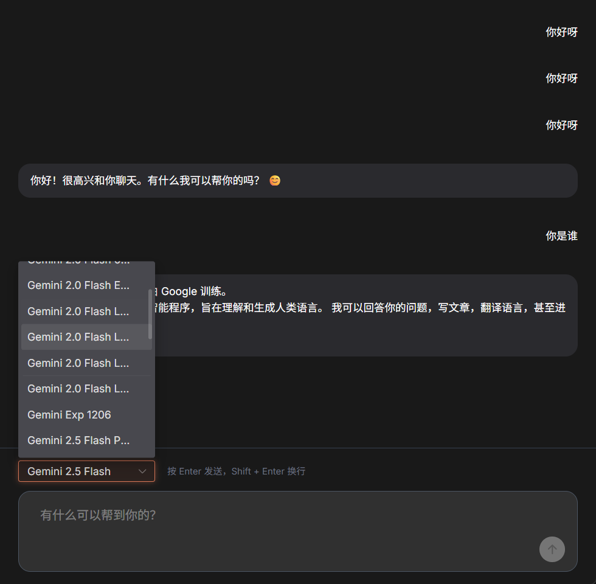

# 任务：Chat 界面改进

## 角色
Frontend (ui-ux-pro-max)

## Skills 依赖
- `.agent/skills/ui-ux-pro-max/SKILL.md`

---

## 背景

MuxueTools 的 Chat 功能已基本可用，支持 SSE 流式响应和 Markdown 渲染。但存在以下 UI/UX 问题：

**当前问题（见下图）：**



1. **模型选择器宽度不足**：模型名称被截断（如 "Gemini 2.0 Flash L..."），用户无法看到完整名称
2. **不支持图片上传**：Gemini Vision 支持图片输入，但 Chat 界面没有上传功能
3. **输入框无附件按钮**：预留位置但未实现

**已完成的前置工作：**
- Chat 基础对话功能 ✅
- SSE 流式响应 ✅
- Markdown + 代码高亮 ✅
- 模型选择器基础实现 ✅
- 会话持久化 ✅

---

## 目标

| # | 目标 | 优先级 |
|---|------|--------|
| 1 | 模型选择器显示完整模型名称 | P0 |
| 2 | 实现图片上传功能 | P0 |
| 3 | 输入框添加附件按钮 | P0 |
| 4 | 消息中显示已上传的图片 | P1 |
| 5 | 支持拖拽上传图片 | P2 |

---

## 步骤

### 阶段 0：阅读规范 (必须)

1. **Skills 规范**
   - `.agent/skills/ui-ux-pro-max/SKILL.md` - UI/UX 设计规范

2. **项目文档**
   - `docs/FRONTEND_WORKFLOW.md` - 前端开发流程
   - `docs/FRONTEND_PROJECT.md` - 前端项目状态
   - `docs/gemini/VISION.md` - Gemini 图片输入规范

3. **相关代码**
   - `web/src/views/ChatView.vue` - Chat 页面
   - `web/src/components/chat/ModelSelector.vue` - 模型选择器
   - `web/src/components/chat/ChatInput.vue` - 输入框组件
   - `web/src/stores/chatStore.ts` - Chat 状态管理

---

### 步骤 1: 修复模型选择器宽度

**修改文件**: `web/src/components/chat/ModelSelector.vue`

**问题**: 当前宽度固定为 `180px`（第 60 行），导致长模型名称被截断。

**解决方案**:
1. 增加宽度或使用自适应宽度
2. 在下拉选项中显示完整名称

```vue
<!-- 修改前 -->
<n-select
    style="width: 180px"
    ...
/>

<!-- 修改后 -->
<n-select
    style="width: 260px"
    :render-label="renderLabel"
    ...
/>
```

或使用 tooltip 显示完整名称。

---

### 步骤 2: 实现图片上传功能

**涉及文件**:
- `web/src/components/chat/ChatInput.vue`
- `web/src/stores/chatStore.ts`
- `web/src/api/chat.ts`

**功能需求**:
1. 添加图片上传按钮（使用图片图标）
2. 支持选择本地图片文件
3. 显示已选择图片的预览缩略图
4. 发送时将图片转为 base64 传递给 API

**实现要点**:
- 使用 `<input type="file" accept="image/*" />` 隐藏元素
- 点击按钮触发 file input
- 使用 FileReader 读取为 base64
- 图片数据存储在 chatStore 中

```typescript
// chatStore.ts 新增
interface PendingImage {
    name: string
    base64: string
    preview: string  // 用于显示的 URL
}

const pendingImages = ref<PendingImage[]>([])
```

---

### 步骤 3: 输入框添加附件按钮

**修改文件**: `web/src/components/chat/ChatInput.vue`

在输入框左侧预留位置添加图片上传按钮：

```vue
<div class="flex gap-2">
    <!-- 图片上传按钮 -->
    <n-button 
        quaternary 
        circle 
        size="small"
        @click="triggerImageUpload"
    >
        <template #icon>
            <n-icon><ImageOutline /></n-icon>
        </template>
    </n-button>
    <input 
        ref="fileInputRef"
        type="file" 
        accept="image/*" 
        multiple
        hidden 
        @change="handleFileSelect"
    />
</div>
```

---

### 步骤 4: 消息中显示图片

**修改文件**: `web/src/components/chat/MessageBubble.vue`

在用户消息气泡中显示已上传的图片：

```vue
<!-- 如果消息包含图片 -->
<div v-if="message.images?.length" class="flex gap-2 mb-2">
    
</div>
```

---

### 步骤 5 (可选): 支持拖拽上传

**修改文件**: `web/src/components/chat/ChatInput.vue`

添加拖放区域处理：

```typescript
function handleDrop(event: DragEvent) {
    event.preventDefault()
    const files = event.dataTransfer?.files
    if (files) {
        handleFiles(Array.from(files))
    }
}
```

---

## 产出文件

| 文件 | 操作 | 说明 |
|------|------|------|
| `web/src/components/chat/ModelSelector.vue` | **MODIFY** | 增加宽度，显示完整名称 |
| `web/src/components/chat/ChatInput.vue` | **MODIFY** | 添加图片上传按钮和逻辑 |
| `web/src/components/chat/MessageBubble.vue` | **MODIFY** | 显示消息中的图片 |
| `web/src/stores/chatStore.ts` | **MODIFY** | 添加图片状态管理和发送逻辑 |
| `web/src/api/types.ts` | **MODIFY** | 添加图片相关类型定义 |

---

## 约束

### 技术约束
- 使用 Naive UI 组件库
- 图片转 base64 后发送（Gemini API 要求）
- 单张图片大小限制（建议 < 4MB）

### 质量约束
- 遵循 `.agent/skills/ui-ux-pro-max/SKILL.md` 设计规范
- 暗色/亮色主题兼容
- 图片上传需有加载状态提示

### 兼容性约束
- 现有 Chat 功能正常
- 不影响纯文本对话

---

## 验收标准

- [ ] 模型选择器可显示完整模型名称
- [ ] 输入框有图片上传按钮
- [ ] 可选择本地图片并显示预览
- [ ] 发送消息时图片正确传递给 API
- [ ] 用户消息气泡显示已发送的图片
- [ ] 暗色/亮色主题下显示正常
- [ ] 现有 Chat 功能不受影响

---

## 交付文档

| 文档 | 更新内容 |
|------|----------|
| `docs/FRONTEND_TASKS.md` | 更新任务 2 状态 |
| `docs/FRONTEND_PROJECT.md` | 更新 Chat 组件状态 |

---

## 开发流程

遵循 `docs/FRONTEND_WORKFLOW.md` 中的 Design-First + Component-Driven 流程。

---

## 参考资料

- Gemini Vision API: `docs/gemini/VISION.md`
- OpenAI Vision 格式参考: 消息 content 支持 `image_url` 类型

---

*任务创建时间: 2026-01-18*
