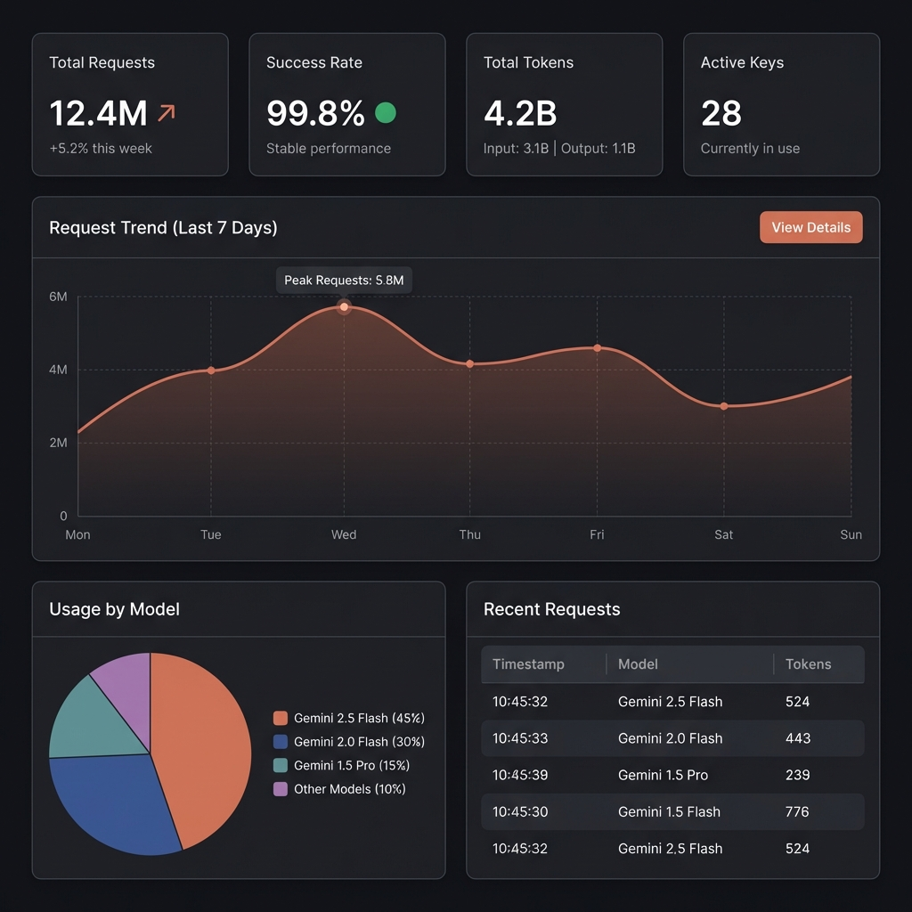

# 任务：Statistics 统计页面实现

## 角色
Developer (senior-golang) + Frontend (ui-ux-pro-max)

## Skills 依赖
- `.agent/skills/senior-golang/SKILL.md`
- `.agent/skills/ui-ux-pro-max/SKILL.md`

---

## 背景

用户选择**概念 A（Claude.ai 风格）**设计方案，需要实现 Statistics 统计页面。

**设计参考：**



**现有后端 API：**
| 端点 | 状态 | 返回数据 |
|------|------|----------|
| `GET /api/stats` | ✅ 已存在 | 聚合统计（总请求、成功率、Token） |
| `GET /api/stats/keys` | ✅ 已存在 | 各 Key 统计 |
| `GET /api/stats/trend` | ❌ 不存在 | 时间序列趋势数据（需新增） |
| `GET /api/stats/models` | ❌ 不存在 | 模型使用分布（需新增） |

---

## 目标

| # | 目标 | 阶段 | 优先级 |
|---|------|------|--------|
| 1 | 后端新增 `/api/stats/trend` | Phase 1 (后端) | P0 |
| 2 | 后端新增 `/api/stats/models` | Phase 1 (后端) | P0 |
| 3 | 4 个统计卡片 | Phase 2 (前端) | P0 |
| 4 | 请求趋势折线图 | Phase 2 (前端) | P1 |
| 5 | 模型使用分布饼图 | Phase 2 (前端) | P1 |
| 6 | 时间/模型筛选器 | Phase 2 (前端) | P1 |

---

## 步骤

### 阶段 0：阅读规范 (必须)

1. **Skills 规范**
   - `.agent/skills/senior-golang/SKILL.md` - Go 开发规范
   - `.agent/skills/ui-ux-pro-max/SKILL.md` - UI/UX 设计规范

2. **项目文档**
   - `docs/DEVELOPMENT.md` - 后端 TDD 工作流
   - `docs/FRONTEND_WORKFLOW.md` - 前端开发流程
   - `docs/API.md` - 现有 API 文档

3. **相关代码**
   - `internal/api/admin_handler.go` - 现有统计 API
   - `internal/types/key.go` - 统计类型定义
   - `web/src/views/StatsView.vue` - 前端骨架

---

## Phase 1: 后端 API 增强 (Go)

遵循 `docs/DEVELOPMENT.md` 中的 TDD 开发流程。

### 步骤 1.1: 新增类型定义

**修改文件**: `internal/types/key.go`

```go
// StatsTimeRange represents supported time ranges for statistics queries.
type StatsTimeRange string

const (
    StatsTimeRange24H  StatsTimeRange = "24h"
    StatsTimeRange7D   StatsTimeRange = "7d"
    StatsTimeRange30D  StatsTimeRange = "30d"
)

// TrendDataPoint represents a single data point in the trend.
type TrendDataPoint struct {
    Timestamp time.Time `json:"timestamp"`
    Requests  int64     `json:"requests"`
    Tokens    int64     `json:"tokens"`
    Errors    int64     `json:"errors"`
}

// TrendResponse represents the response for GET /api/stats/trend.
type TrendResponse struct {
    Success bool             `json:"success"`
    Data    []TrendDataPoint `json:"data"`
}

// ModelUsageItem represents usage statistics for a single model.
type ModelUsageItem struct {
    Model        string  `json:"model"`
    RequestCount int64   `json:"request_count"`
    TokenUsage   int64   `json:"token_usage"`
    Percentage   float64 `json:"percentage"`
}

// ModelUsageResponse represents the response for GET /api/stats/models.
type ModelUsageResponse struct {
    Success bool             `json:"success"`
    Data    []ModelUsageItem `json:"data"`
}
```

---

### 步骤 1.2: 实现趋势 API

**修改文件**: `internal/api/admin_handler.go`

```go
// GetStatsTrend handles GET /api/stats/trend - Get request trend over time.
// Query params:
//   - range: 24h | 7d | 30d (default: 7d)
func (h *AdminHandler) GetStatsTrend(c *gin.Context) {
    rangeStr := c.DefaultQuery("range", "7d")
    
    // Calculate time points based on range
    var points []types.TrendDataPoint
    now := time.Now()
    
    switch rangeStr {
    case "24h":
        // 24 points (hourly)
        for i := 23; i >= 0; i-- {
            t := now.Add(-time.Duration(i) * time.Hour)
            points = append(points, types.TrendDataPoint{
                Timestamp: t.Truncate(time.Hour),
                Requests:  0, // TODO: Query from storage
                Tokens:    0,
                Errors:    0,
            })
        }
    case "7d":
        // 7 points (daily)
        for i := 6; i >= 0; i-- {
            t := now.AddDate(0, 0, -i)
            points = append(points, types.TrendDataPoint{
                Timestamp: t.Truncate(24 * time.Hour),
                Requests:  0, // TODO: Aggregate from keys
                Tokens:    0,
                Errors:    0,
            })
        }
    case "30d":
        // 30 points (daily)
        for i := 29; i >= 0; i-- {
            t := now.AddDate(0, 0, -i)
            points = append(points, types.TrendDataPoint{
                Timestamp: t.Truncate(24 * time.Hour),
                Requests:  0,
                Tokens:    0,
                Errors:    0,
            })
        }
    }
    
    // Populate with current aggregated data (simplified)
    stats := h.pool.GetStats()
    if len(points) > 0 && len(stats) > 0 {
        // Distribute current stats to last point for now
        lastIdx := len(points) - 1
        for _, key := range stats {
            points[lastIdx].Requests += key.Stats.RequestCount
            points[lastIdx].Tokens += key.Stats.TotalTokens()
            points[lastIdx].Errors += key.Stats.ErrorCount
        }
    }
    
    c.JSON(http.StatusOK, types.TrendResponse{
        Success: true,
        Data:    points,
    })
}
```

---

### 步骤 1.3: 实现模型分布 API

**修改文件**: `internal/api/admin_handler.go`

```go
// GetStatsModels handles GET /api/stats/models - Get usage by model.
func (h *AdminHandler) GetStatsModels(c *gin.Context) {
    stats := h.pool.GetStats()
    
    // Aggregate by default_model
    modelMap := make(map[string]types.ModelUsageItem)
    var totalRequests int64
    
    for _, key := range stats {
        model := key.DefaultModel
        if model == "" {
            model = "unknown"
        }
        
        item := modelMap[model]
        item.Model = model
        item.RequestCount += key.Stats.RequestCount
        item.TokenUsage += key.Stats.TotalTokens()
        modelMap[model] = item
        
        totalRequests += key.Stats.RequestCount
    }
    
    // Calculate percentages
    result := make([]types.ModelUsageItem, 0, len(modelMap))
    for _, item := range modelMap {
        if totalRequests > 0 {
            item.Percentage = float64(item.RequestCount) / float64(totalRequests) * 100
        }
        result = append(result, item)
    }
    
    c.JSON(http.StatusOK, types.ModelUsageResponse{
        Success: true,
        Data:    result,
    })
}
```

---

### 步骤 1.4: 注册新路由

**修改文件**: `internal/api/router.go`

在统计路由组中添加：

```go
api.GET("/stats/trend", adminHandler.GetStatsTrend)
api.GET("/stats/models", adminHandler.GetStatsModels)
```

---

### 步骤 1.5: 更新 API 文档

**修改文件**: `docs/API.md`

在"统计 API"章节添加新端点文档。

---

## Phase 2: 前端实现 (Vue)

遵循 `docs/FRONTEND_WORKFLOW.md` 中的 Design-First + Component-Driven 流程。

### 步骤 2.1: 安装图表库

```bash
cd web
npm install echarts vue-echarts
```

---

### 步骤 2.2: 创建 API 和 Store

**新建文件**: `web/src/api/stats.ts`:
- `getStats()` - 聚合统计
- `getKeyStats()` - Key 统计
- `getStatsTrend(range)` - 趋势数据
- `getStatsModels()` - 模型分布

**新建文件**: `web/src/stores/statsStore.ts`:
- 状态管理和 fetch actions

---

### 步骤 2.3: 实现 StatsView.vue

按概念 A 布局实现：
1. 4 个统计卡片
2. 请求趋势折线图 (ECharts)
3. 模型分布饼图 (ECharts)  
4. 最近请求表格（可选）
5. 时间/模型筛选器

---

## 产出文件

### Phase 1 (后端)
| 文件 | 操作 |
|------|------|
| `internal/types/key.go` | **MODIFY** |
| `internal/api/admin_handler.go` | **MODIFY** |
| `internal/api/router.go` | **MODIFY** |
| `docs/API.md` | **MODIFY** |

### Phase 2 (前端)
| 文件 | 操作 |
|------|------|
| `web/src/views/StatsView.vue` | **MODIFY** |
| `web/src/stores/statsStore.ts` | **NEW** |
| `web/src/api/stats.ts` | **NEW** |
| `web/src/api/types.ts` | **MODIFY** |

---

## 约束

### 技术约束
- 后端遵循 Go 1.22+ 标准
- 前端使用 ECharts (vue-echarts)
- 保持 Claude.ai 深色主题风格

### 质量约束
- 后端遵循 `.agent/skills/senior-golang/SKILL.md`
- 前端遵循 `.agent/skills/ui-ux-pro-max/SKILL.md`

---

## 验收标准

### Phase 1 (后端)
- [ ] `GET /api/stats/trend?range=7d` 返回趋势数据
- [ ] `GET /api/stats/models` 返回模型分布
- [ ] `go test ./internal/api/...` 通过

### Phase 2 (前端)
- [ ] 4 个统计卡片正确显示
- [ ] 趋势折线图正常渲染
- [ ] 模型分布饼图正常渲染
- [ ] 筛选器功能正常
- [ ] 暗色/亮色主题兼容

---

## 交付文档

| 文档 | 更新内容 |
|------|----------|
| `docs/API.md` | 新增统计 API 文档 |
| `docs/FRONTEND_TASKS.md` | 更新任务 3 状态 |
| `docs/FRONTEND_PROJECT.md` | 更新 StatsView 状态 |

---

## 开发流程

1. **Phase 1 (后端)**: 遵循 `docs/DEVELOPMENT.md` TDD 流程
2. **Phase 2 (前端)**: 遵循 `docs/FRONTEND_WORKFLOW.md` 流程

---

*任务创建时间: 2026-01-18*
*最后更新: 2026-01-18*
