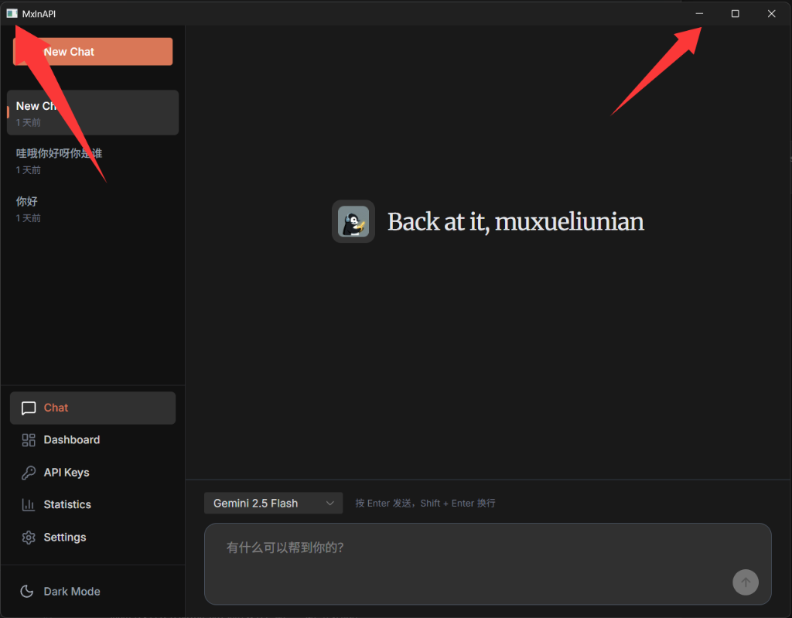

# 任务：Windows 桌面窗口标题栏自定义

## 角色
Developer (senior-golang skill) + Frontend (ui-ux-pro-max skill)

## 技能依赖
- **后端开发**: `.agent/skills/senior-golang/SKILL.md`
- **前端设计**: `.agent/skills/ui-ux-pro-max/SKILL.md`

---

## 背景

MxlnAPI 桌面应用使用 `webview_go` 作为 WebView 封装层，当前窗口使用 Windows 原生标题栏。

**需要解决的两个问题（见下图）：**



1. **左侧箭头 - 应用图标**: 窗口左上角的应用图标，当前显示默认图标，需要显示自定义的企鹅图标
2. **右侧箭头 - 标题栏按钮**: 右上角的最小化 `─`、最大化 `☐`、关闭 `✕` 三个按钮，需要自定义样式以匹配应用 UI 风格

**现有技术栈：**
- 后端: Go + `github.com/webview/webview_go`
- 前端: Vue 3 + Naive UI + TailwindCSS
- 构建: `scripts/build.ps1` + `rsrc` 图标嵌入

---

## 目标

| Phase | 目标 | 具体内容 | 状态 |
|-------|------|----------|------|
| **Phase 1** | 自定义窗口左上角图标 | 使应用图标正确显示为企鹅图标 | ✅ 完成 |
| **Phase 2** | 自定义标题栏按钮 | 实现自定义样式的最小化/最大化/关闭按钮 | ❌ 取消 (技术限制) |

---

## 步骤

### 阶段 0：阅读规范 (必须)

1. **技能规范**
   - `.agent/skills/senior-golang/SKILL.md` - Go 开发规范
   - `.agent/skills/ui-ux-pro-max/SKILL.md` - UI/UX 设计规范（Phase 2 需要）

2. **项目文档**
   - `docs/ARCHITECTURE.md` - 系统架构（桌面应用部分）
   - `docs/DEVELOPMENT.md` - 开发工作流
   - `docs/FRONTEND_WORKFLOW.md` - 前端开发流程

3. **现有代码**
   - `cmd/desktop/main.go` - 桌面应用入口
   - `scripts/build.ps1` - 构建脚本
   - `web/src/App.vue` - 前端根组件
   - `web/src/layouts/MainLayout.vue` - 主布局

---

## Phase 1: 自定义窗口左上角图标

### 1.1 问题分析

当前使用 `rsrc` 工具生成 `.syso` 资源文件，但 Windows Shell 要求应用程序主图标的资源 ID 必须为 `1`（即 `IDI_ICON1`），否则窗口左上角可能显示默认图标。

### 1.2 解决方案

使用 Windows 资源编译器 `windres`（MinGW 工具链）替代或补充 `rsrc`，通过 `.rc` 资源脚本显式指定图标资源 ID。

### 1.3 实施步骤

#### 步骤 1: 创建资源脚本文件

**新建文件**: `cmd/desktop/app.rc`

```rc
// Windows Resource Script for MxlnAPI Desktop
// Defines application icon with standard Windows resource IDs

// IDI_APPLICATION (32512) - Standard Windows application icon ID
// Used by Windows Shell for window icon and taskbar
32512 ICON "../../assets/icon.ico"

// ID 1 - Alternative icon ID (backup for some contexts)
1 ICON "../../assets/icon.ico"
```

> ⚠️ **关键**: 必须使用资源 ID `32512` (`IDI_APPLICATION`)，这是 Windows Shell 识别主窗口图标的标准 ID。

#### 步骤 2: 修改构建脚本

**修改文件**: `scripts/build.ps1`

更新 `Ensure-IconResource` 函数，优先使用 `windres` 编译资源（详见文件）。

#### 步骤 3: 验证

```powershell
# 编译桌面应用
.\scripts\build.ps1 desktop

# 运行验证
.\bin\mxlnapi.exe
```

**验收检查点：**
- [x] 窗口左上角显示企鹅图标 ✅ (2026-01-18)
- [x] 任务栏图标显示企鹅图标 ✅ (2026-01-18)
- [x] Alt+Tab 切换时显示企鹅图标 ✅ (2026-01-18)

### 1.4 Phase 1 产出文件

| 文件 | 操作 | 说明 |
|------|------|------|
| `cmd/desktop/app.rc` | **NEW** ✅ | Windows 资源脚本 |
| `scripts/build.ps1` | **MODIFY** ✅ | 添加 windres 支持 |
| `docs/bugs/BUG-001_WINDOW_ICON.md` | **NEW** ✅ | Bug 记录文档 |
| `docs/DEVELOPMENT.md` | **MODIFY** ✅ | 添加 MinGW 依赖说明 |

### 1.5 Phase 1 状态

> ✅ **Phase 1 已完成** (2026-01-18)


---

## Phase 2: 自定义标题栏按钮

### 2.1 目标

实现自定义样式的标题栏按钮（最小化、最大化、关闭），使其与 MxlnAPI 的深色主题 UI 风格一致。

**设计要求：**
- 按钮样式匹配 Naive UI 深色主题
- 最小化/最大化按钮 hover 时显示浅色高亮
- 关闭按钮 hover 时显示红色高亮
- 保持无边框窗口可拖拽

### 2.2 技术方案

由于标准的 `webview_go` 库不直接支持自定义原生标题栏，有两种实现路径：

| 方案 | 描述 | 优点 | 缺点 |
|------|------|------|------|
| **A: 无边框窗口 + 前端 TitleBar** | 隐藏原生标题栏，用 CSS/Vue 实现自定义按钮 | 完全自定义 | 需换库或 fork |
| **B: 保持原生标题栏 + 样式增强** | 使用 Windows API 修改原生按钮颜色 | 改动小 | 自定义程度有限 |

**推荐方案**: A（无边框窗口 + 前端 TitleBar）

### 2.3 技术选型 Spike（前置步骤）

在正式实施前，需要验证 WebView 库的 frameless 能力：

1. **评估** `github.com/nicbarker/clay` 或 `github.com/ArekSredzki/webview` fork
2. **测试** 无边框窗口创建
3. **测试** Go ↔ JS 函数绑定（窗口控制）

> ⚠️ **建议**: 在确认技术可行性后再继续 Phase 2 实施

### 2.4 实施步骤（方案 A）

#### 步骤 1: 后端改造 - 无边框窗口

**修改文件**: `cmd/desktop/main.go`

```go
// 创建无边框 WebView 窗口
w := webview.New(*debug)
w.SetTitle("MxlnAPI")
w.SetSize(1024, 768, webview.HintNone)

// 绑定窗口控制函数供前端调用
w.Bind("windowMinimize", func() {
    // 调用系统 API 最小化窗口
})
w.Bind("windowMaximize", func() {
    // 切换最大化/还原状态
})
w.Bind("windowClose", func() {
    w.Terminate()
})
w.Bind("startDrag", func() {
    // 开始窗口拖拽
})
```

#### 步骤 2: 前端 TitleBar 组件

**新建文件**: `web/src/components/TitleBar.vue`

```vue
<template>
  <div v-if="isDesktopApp" class="title-bar">
    <!-- 左侧：应用图标 + 标题 -->
    <div class="title-bar-left" @mousedown="startDrag">
      
      <span class="app-title">MxlnAPI</span>
    </div>
    
    <!-- 右侧：窗口控制按钮 -->
    <div class="title-bar-buttons">
      <button @click="minimize" class="btn btn-minimize" title="最小化">
        <span class="icon">─</span>
      </button>
      <button @click="toggleMaximize" class="btn btn-maximize" title="最大化">
        <span class="icon">{{ isMaximized ? '❐' : '☐' }}</span>
      </button>
      <button @click="close" class="btn btn-close" title="关闭">
        <span class="icon">✕</span>
      </button>
    </div>
  </div>
</template>

<script setup lang="ts">
/**
 * TitleBar - 自定义窗口标题栏组件
 * 仅在 WebView 桌面应用环境中渲染
 * 提供窗口拖拽和最小化/最大化/关闭功能
 */
import { ref, onMounted } from 'vue'

// 检测是否为桌面应用环境
const isDesktopApp = ref(false)
const isMaximized = ref(false)

onMounted(() => {
  isDesktopApp.value = typeof (window as any).windowClose === 'function'
})

function minimize() {
  (window as any).windowMinimize?.()
}

function toggleMaximize() {
  (window as any).windowMaximize?.()
  isMaximized.value = !isMaximized.value
}

function close() {
  (window as any).windowClose?.()
}

function startDrag(event: MouseEvent) {
  // 仅在非按钮区域拖拽
  if ((event.target as HTMLElement).closest('.title-bar-buttons')) return
  (window as any).startDrag?.()
}
</script>

<style scoped>
.title-bar {
  height: 36px;
  background: var(--n-color); /* Naive UI 主题色 */
  display: flex;
  justify-content: space-between;
  align-items: center;
  user-select: none;
  -webkit-app-region: drag;
}

.title-bar-left {
  display: flex;
  align-items: center;
  gap: 8px;
  padding-left: 12px;
}

.app-icon {
  width: 20px;
  height: 20px;
}

.app-title {
  font-size: 13px;
  color: var(--n-text-color);
}

.title-bar-buttons {
  display: flex;
  -webkit-app-region: no-drag;
}

.btn {
  width: 46px;
  height: 36px;
  border: none;
  background: transparent;
  color: var(--n-text-color);
  cursor: pointer;
  transition: background 0.15s;
}

.btn:hover {
  background: rgba(255, 255, 255, 0.1);
}

.btn-close:hover {
  background: #e81123;
  color: white;
}

.icon {
  font-size: 12px;
}
</style>
```

#### 步骤 3: 集成到主布局

**修改文件**: `web/src/App.vue`

```vue
<template>
  <n-config-provider :theme="theme">
    <TitleBar />
    <MainLayout />
  </n-config-provider>
</template>

<script setup lang="ts">
import TitleBar from '@/components/TitleBar.vue'
// ...
</script>
```

#### 步骤 4: 调整布局高度

**修改文件**: `web/src/layouts/MainLayout.vue`

确保主布局考虑 TitleBar 占用的 36px 高度：

```css
.main-layout {
  height: calc(100vh - 36px); /* 扣除标题栏高度 */
}
```

### 2.5 Phase 2 产出文件

| 文件 | 操作 | 说明 |
|------|------|------|
| `cmd/desktop/main.go` | **MODIFY** | 无边框窗口 + 函数绑定 |
| `web/src/components/TitleBar.vue` | **NEW** | 自定义标题栏组件 |
| `web/src/App.vue` | **MODIFY** | 集成 TitleBar |
| `web/src/layouts/MainLayout.vue` | **MODIFY** | 调整布局高度 |
| `web/src/assets/main.css` | **MODIFY** | 标题栏样式变量 |

---

## 约束

### 技术约束
- Go 版本: 1.22+
- 构建依赖: MinGW (`windres`) 或 `rsrc`
- WebView: 使用 Edge WebView2 运行时 (Windows 10/11)

### 质量约束
- 遵循 `senior-golang` Skill 的 Go 代码规范
- 遵循 `ui-ux-pro-max` Skill 的 UI 设计规范
- Phase 2 TitleBar 设计需先获得用户确认

### 兼容性约束
- Phase 1 不应影响现有功能
- Phase 2 需保持浏览器环境正常使用（TitleBar 不渲染）
- 前端代码需检测桌面环境，避免在浏览器中报错

---

## 验收标准

### Phase 1 验收
- [ ] `.\scripts\build.ps1 desktop` 编译成功
- [ ] 窗口左上角显示企鹅图标
- [ ] 任务栏图标显示企鹅图标
- [ ] Alt+Tab 窗口切换图标正确
- [ ] 现有功能正常（Chat、Key 管理、Settings）

### Phase 2 验收
- [ ] 标题栏显示自定义的三个按钮
- [ ] 最小化按钮功能正常
- [ ] 最大化/还原按钮功能正常
- [ ] 关闭按钮正确退出应用
- [ ] 标题栏区域可拖拽移动窗口
- [ ] 按钮 hover 效果符合设计（关闭按钮红色）
- [ ] 浏览器环境不显示 TitleBar（优雅降级）
- [ ] 深色主题下样式一致

---

## 交付文档

| 文档 | 更新内容 |
|------|----------|
| `docs/ARCHITECTURE.md` | 新增"窗口自定义"章节，描述图标和标题栏实现 |
| `docs/DEVELOPMENT.md` | 更新构建说明（windres 依赖）|
| `docs/FRONTEND_PROJECT.md` | 更新 TitleBar 组件状态 |

---

## 开发流程

```
1. 阅读本任务文档 + 相关 Skills
           │
           ▼
2. Phase 1 实施
   - 创建 app.rc
   - 修改 build.ps1
   - 编译验证
           │
           ▼
3. Phase 1 验收（与用户确认）
           │
           ▼
4. Phase 2 技术 Spike
   - 评估 WebView 库 frameless 支持
   - 与用户确认方案
           │
           ▼
5. Phase 2 设计确认
   - 遵循 ui-ux-pro-max 流程
   - 生成 TitleBar Mockup
   - 获得用户批准
           │
           ▼
6. Phase 2 实施
           │
           ▼
7. Phase 2 验收
           │
           ▼
8. 更新交付文档
```

---

## 风险与注意事项

| 风险 | 影响 | 缓解措施 |
|------|------|----------|
| MinGW 未安装 | Phase 1 无法使用 windres | 保持 rsrc 回退 |
| webview_go 不支持 frameless | Phase 2 阻塞 | 评估换库或 fork |
| Windows 系统主题兼容 | 浅色/深色主题下显示不一致 | 使用 CSS 变量适配 |
| 窗口拖拽性能 | 拖拽卡顿 | 优化事件处理 |

---

*任务创建时间: 2026-01-15*
*最后更新: 2026-01-17*
